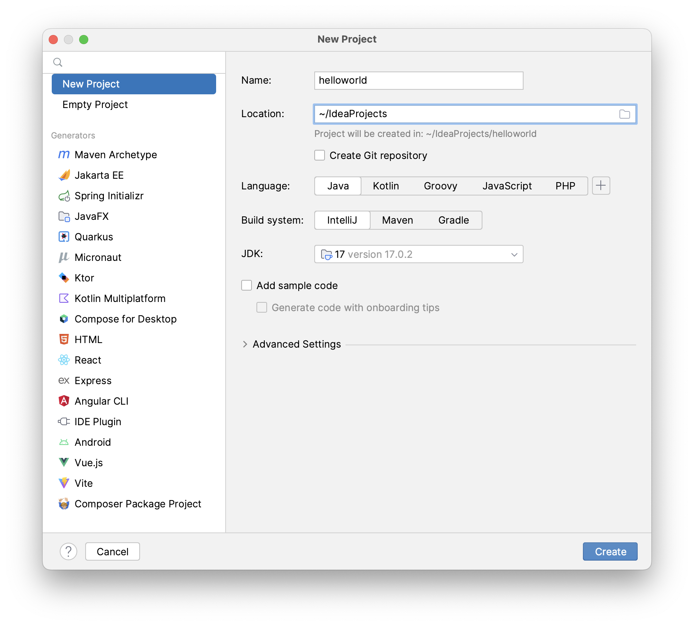
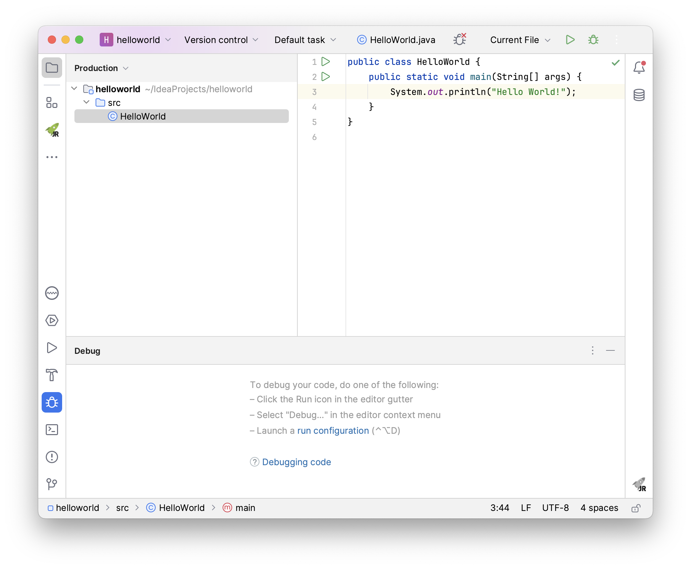

# Laboratorium 1

1. Korzystając z narzędzi dostępnych w JDK napisz, skompiluj i uruchom pierwszy program w języku Java.

```java
public class HelloWorld {
        public static void main(String[] args) {
                System.out.println("Hello World!");
        }
}
``` 
* Uruchom w Windows **Wiersz polecenia** (przycisk Start, cmd).
**Porada:** Możesz zwiększyć czcionkę w terminalu używając skrótu ctrl + =.

* Sprawdź wersje oraz dostępność zainstalowanych komponentów JDK.

```bash
java -version
javac -version
```

* Na dysku Z: utwórz za pomocą notatnika plik _HelloWorld.java_ i wpisz w nim program.
* Korzystając z kompilatora javac, skompiluj program do bajtkodu otrzymując plik _HelloWorld.class_.

```bash
javac HelloWorld.java
```

* Poleceniem _java_ uruchom wirtualną maszynę i wykonaj skompilowany wcześniej program.  
**Porada:** Gdy uruchamiasz program podaj tylko nazwę pliku/klasy, nie wpisuj rozszerzenia.

```bash
java HelloWorld
```

{:start="2"}
2. Korzystając z IntelliJ IDEA uruchom program _HelloWorld_ z punktu 1.

* Otwórz środowisko programistyczne **IntelliJ IDEA** (przycisk Start, idea).
* Na ekranie powitalnym kliknij opcję **New Project**.

* Nazwij projekt **helloworld**.
* Upewnij się, że jest wskazane JDK.
* Odznacz opcję **Add sample code**.
* Kliknij przycisk **Create**.
  
* W projekcie, kliknij prawym przyciskiem na folderze **src** i utwórz nową klasę wybierając **New -> Java Class**.
* Wprowadź kod programu.
* Skompiluj i uruchom program korzystając z przycisku **Run** *(Shift+F10)*.
