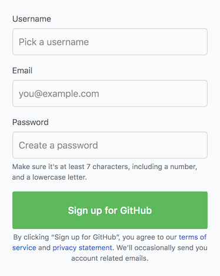
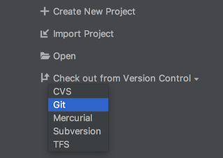

# GitHub

1. Załóż konto w serwisie **GitHub** (jeżeli nie posiadasz)
- uruchom w przeglądarce stronę **https://github.com**
- wprowadź nazwę użytkownika, email oraz hasło
- dokończ działanie kreatora wybierając (domyślną) bezpłatną wersję usługi
- sprawdź skrzynkę email i dokonaj weryfikacji adresu klikając w link **Verify email address**

{:start="2"}
2. Stwórz nowe repozytorium
- skorzystaj z przycisku **Start project** lub **New repository**
- wprowadź nazwę repozytorium np. "testowe-repo"
- dodaj opcjonalny opis
- pozostaw repozytorium jako publiczne (Public)
- zaznaczając opcję inicjacji repozytorium **Initialize this repository with a README**

3. Stwórz w repozytorium plik z programem w javie
- kliknij **Create new file**
- podaj nazwę pliku i wprowadź jego treść (może być HelloWorld.java)
- zatwierdź zmiany przyciskiem **Commit new file**

{:start="4"}

4. Załaduj kilka dodatkowych plików do repozytorium
- za pomocą opcji **Upload files** dodaj kilka plików różnych typów (np: .java, .txt, .jpg)
- skorzystaj z opcji **choose your files**
- "zakomituj" zmiany **Commit changes**

5. Dodaj opis projektu do pliku README.md
- kliknij w plik README.md
- przejdź w tryb edycji ikoną ołówka lub naciskając **"e"**
- Dodaj nagłówek, krótki opis oraz wypunktowaną listę nazw plików znajdujących się w repozytorium
- zatwierdź zmiany **Commit changes**

6. Uruchom projekt w **IntelliJ IDEA**
- uruchom IDE
- wybierz opcję **Checkout from Version Controll** a następnie GIT
- wklej URL swojego repozytorium z GitHuba i dokonaj klonowania **Clone**
- stwórz nowy projekt podążając za kreatorem

{:start="4"}

7. Dokonaj zmian w swoim projekcie
- uruchom programy java i jeżeli to konieczne dokonaj niezbędnych poprawek
- dodaj komentarze do kodu
- do pliku **README.md** dodaj grafikę

8. Przeglądnij lokalną historię zmian wybranych plików
- wybierz z menu VCS -> Local History -> Show History
- dokonaj przeglądu zmian

9. Zatwierdź zmiany i wyślij je do zdalnego repozytorium
- wybierz z menu VCS -> VCS Operations Popoup -> Commit... lub użyj skrótu **Ctrl+K**
- wprowadź opis **Commit Message** i zatwierdź **Commit**
- następnie wybierz z menu VCS -> VCS Operations Popoup -> Push... lub użyj skrótu **Ctrl+Shift+K**
- naciśnij **Push** aby wysłać pliki do zdalnego repozytorium

10. Przejdź do GitHub i zweryfikuj przesłane zmiany
