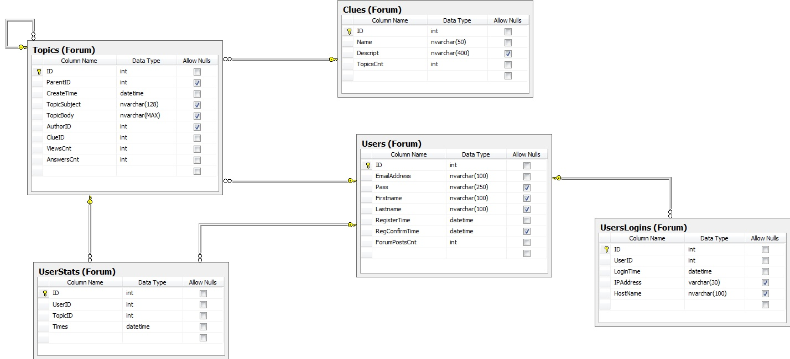

# SQL Lab 2

Na podstawie diagramu oraz poniższych wytycznych utwórz w swojej bazie strukturę forum i wypełnij ją danymi testowymi.

## Diagram ##

## Schemat ##
Utwórz w swojej bazie (nazwa bazy to Twój login) schemat o nazwie Forum.

## Tabele ##
Utwórz w schemacie Forum poniższe tabele:

Nazwa tabeli | Opis 
-------------|-------------------------------------
Topics  | Każdy temat/post utworzony w forum jest przechowywany w tej tabeli. Każdy główny post wątku (zazwyczaj pytanie), ma ustawioną wartość NULL w kolumnie ParentID. Każdy następny post w tym wątku (odpowiedź) ma zapisany w ParentID identyfikator głównego postu. Tylko zarejestrowani i zalogowani użytkownicy mogą tworzyć nowe posty, a więc wystarczy kolumna AuthorID, która jest kluczem obcym do tabeli Users.|
Clues | Działy forum, w których można pisać posty.|
Users | Lista zarejestrowanych użytkowników, którzy mogą pisać posty.
UsersLogins | Data i czas wraz z adresem IP dla każdego logowania na forum. Historia logowań.
UserStats | Data i czas wyświetlenia każdego z postów przez każdego z użytkowników. Na podstawie tej tabeli widać czy użytkownik X otwierał już poszczególne posty i odpowiednio wyróżnić nieprzeczytane (nowe).

## Klucze obce ##
Dodaj do tabel klucze obce wg schematu:

Nazwa tabeli | Nazwa kolumny Powiązana  | tabela i kolumna
-------------|--------------------------|------------------
Topics | ParentID | Topics.ID
| AuthorID | Users.ID
| ClueID | Clues.ID
UsersStats | UserID | Users.ID
| TopicID | Topics.ID
UsersLogins | UserID  | Users.ID

## Wartości domyślne ##
Zdefiniuj wartości domyślme wg wytycznych z poniższej tabeli:

Nazwa tabeli | Nazwa kolumny | Wartość/wyrażenie default
-------------|---------------|------------------------------------
Topics | CreateTime | Aktualny czas (funkcja GETDATE)
Users | RegisterTime |
UserStats | Times
UsersLogins | LoginTime
Clues | TopicsCnt  | 0
Users | ForumPostsCnt | 0
Topics | ViewsCnt | 0
Topics | AnswersCnt | 0

## Ograniczenia typu CHECK ##
Dodaj ograniczenie:

Nazwa tabeli | Nazwa kolumny | Definicja Check
-------------|---------------|-----------------
Users | EmailAddress | Validate e-mail address (for example: CHARINDEX('@',EmailAddress) <> 0)

## Dane testowe ##
Skorzystaj z zamieszczonego poniżej skryptu i uzupełnij stworzoną strukturę danymi testowymi.

[sql2_forum_dane_testowe.sql](sql2_forum_dane_testowe.sql)

## Widoki ##
Utwórz dodatkowe widoki korzystając z przygotowanego poniżej skryptu.

[sql2_forum_widoki.sql](sql2_forum_widoki.sql)